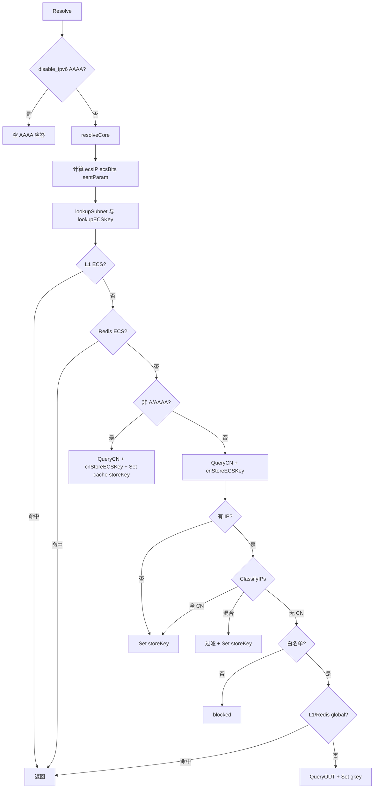

# 智能解析查询逻辑说明（供确认）

本文描述 `Resolver.Resolve` → `resolveCore` 的主路径，以及与 **ECS、Redis/L1 缓存、国内/海外上游、白名单** 的交互。代码位置以仓库根为基准。

---

## 1. 入口与前置

| 步骤 | 说明 | 代码 |
|------|------|------|
| 1.1 | 取当前配置 `cfg := cfgStore.Get()` | `resolver.go` `Resolve` |
| 1.2 | 校验 `req.Msg` 与 Question 非空 | `Resolve` |
| 1.3 | 若配置 `disable_ipv6` 且 QTYPE=AAAA：直接构造空应答（不访问上游），随后 `stripAAAARecords` | `Resolve`、`ipv6DisabledAAAAResponse` |
| 1.4 | 过载：`guard.AllowGlobal()` 为 false 则 `ErrOverload` | `resolveCore` |

---

## 2. 客户端与 ECS 上下文（resolveCore 开头）

| 符号 | 含义 |
|------|------|
| `realIP` | `mapper.GetRealIP(ctx, ClientVIP)`，失败则 `ParseIP(ClientVIP)` |
| `ecsSourceIP` | `mapper.PublicUnicastIP(realIP)`，仅公网单播用于上游 ECS |
| `clientECS` | `req.ClientECS`，若空则从报文 `ecs.EDNS0Subnet(req.Msg)` 取首条 ECS |
| `cnECSDefault` | 配置 `mapper.default_cn_ecs` 解析为 IP |
| `subnetIP` | 若配置了 `default_cn_ecs` 则用该 IP；否则用 `ecsSourceIP`（用于「无客户端 ECS 时」推导子网维度） |
| `effectiveSubnetECS` | 一般为 `clientECS`；若配置了 `default_cn_ecs` 则强制为 `""`（与发往国内上游的 ECS 一致：固定默认源） |
| `ecsIP, ecsBits` | `cnUpstreamECS(ecsSourceIP, clientECS, cnECSDefault)`：有默认国内 ECS 时固定为 v4 `/24` 或 v6 `/48`；否则 `ecsNetForQuery`（优先客户端 CIDR，否则映射公网 /24 或 /48，等） |

**发往国内上游的 EDNS0/wire 与 Google JSON 的 `edns_client_subnet` 参数**均基于上述 `ecsIP, ecsBits`。

---

## 3. ECS 缓存维度：读键（lookup）

| 步骤 | 说明 |
|------|------|
| 3.1 | `sentParam := ecs.GoogleSubnetQueryParam(ecsIP, ecsBits)` — 与 Google JSON GET 中 `edns_client_subnet` 字符串一致；无 ECS 时为空字符串 |
| 3.2 | `mappedECS, _ := cache.GetGoogleECSMap(ctx, sentParam)` — Redis 键 `dns:ecsmap:{url.PathEscape(sent)}`，记录「本次发送的 subnet → 上次观测到的 Google JSON 回显有效范围」 |
| 3.3 | `lookupSubnet := ecs.SubnetKeyForRead(mappedECS, sentParam, effectiveSubnetECS, subnetIP)` 优先级：**映射值（规范化有效）** → **sentParam（规范化有效）** → **`FromClientOrIP(effectiveSubnetECS, subnetIP)`** |
| 3.4 | `lookupECSKey := cache.ECSKey(qname, qtype, lookupSubnet)`，形式 `dns:{domain}:{type}:ecs:{subnet}`（写入上游结果时可能使用不同的 `storeKey`，见 `cnStoreECSKey`） |

`ValidNormalizedSubnet` 会拒绝 **前缀长度为 0（含 `/0`）** 的 CIDR；规范化后的字符串用于键（与 `net.ParseCIDR` + mask 一致）。

---

## 4. ECS 作用域缓存（L1 + Redis）

| 顺序 | 行为 |
|------|------|
| 4.1 | **L1** `l1.Get(lookupECSKey)`，命中则复制 `Msg` 并 `SetReply(req.Msg)`，打 trace `from_cache=l1_ecs` |
| 4.2 | **Redis** `cache.Get(ctx, lookupECSKey)`，命中同上，`from_cache=redis_ecs` |
| 4.3 | 均未命中则继续下游逻辑 |

---

## 5. 分支 A：非 A/AAAA

| 步骤 | 行为 |
|------|------|
| 5.1 | `queryCNWithECSTrace`（内部：`queryCNCoalesced` → `cnStoreECSKey` → 更新 `EffectiveSubnet` → `annotateCNTrace`）→ `pool.QueryCN`（见第 8 节） |
| 5.2 | `cnStoreECSKey`：根据 `cnResp.GoogleEchoedECS`（仅 Google JSON 有）、`sentParam`、`effectiveSubnetECS`、`subnetIP` 计算 **`storeSubnet`** 与 **`storeKey`**；若 `sentParam` 非空且 JSON 回显规范化有效，则 **`SetGoogleECSMap(sentParam, echoNorm)`**（默认 TTL 7 天） |
| 5.3 | 由 `queryCNWithECSTrace` 完成 trace 中 `EffectiveSubnet` 与 `annotateCNTrace` |
| 5.4 | `effectiveTTL` 后 **`setBothCaches(ctx, storeKey, cnResp, ttl)`**（Redis + L1） |
| 5.5 | 返回 `CNOnly: true` |

---

## 6. 分支 B：A/AAAA — 国内上游与 IP 分类

| 步骤 | 行为 |
|------|------|
| 6.1 | 同样 `queryCNWithECSTrace`（与 5.1 相同模式） |
| 6.2 | `models.ExtractIPs(cnResp.Msg)` |
| 6.3 | **无 A/AAAA**：写 **`storeKey`**，CNOnly 返回 |
| 6.4 | **`geoip.CN.ClassifyIPs`**：若 **全部国内**：写 **`storeKey`**，CNOnly 返回 |
| 6.5 | **混合**：`filterAnswersByIPs` 仅保留国内 IP，构造新 `DNSResponse`，写 **`storeKey`**，CNOnly 返回 |
| 6.6 | **无国内 IP**：进入白名单与海外路径（第 7 节） |

---

## 7. 白名单与海外（全局键）

| 步骤 | 行为 |
|------|------|
| 7.1 | `wl.Allowed(qname)` 为 false：`blocked(...)`（NXDOMAIN 或 localhost，依 `non_whitelist_action`） |
| 7.2 | `gkey := cache.GlobalKey(qname, qtype)` → `dns:{domain}:{type}:global` |
| 7.3 | **L1 / Redis** 按 `gkey` 查询，命中则 `from_cache=l1_global` / `redis_global` |
| 7.4 | `outEcsIP, outEcsBits := outUpstreamECS(...)`（含 `default_out_ecs` / `default_cn_ecs` 与客户端 ECS 的组合规则） |
| 7.5 | `queryOUTCoalesced` → `pool.QueryOUT` |
| 7.6 | `setBothCaches(ctx, gkey, outResp, ttl)` — **仅全局键**，与 ECS 子网键无关 |
| 7.7 | 返回 `WentOUT: true` |

---

## 8. 上游池 `Pool.query`（CN/OUT 共用）

| 步骤 | 行为 |
|------|------|
| 8.1 | 复制 `req.Msg`，新 `Id`，`RD=true` |
| 8.2 | 若 `ecsIP != nil && ecsBits > 0`：`setECS` 写入 EDNS0 CLIENT-SUBNET |
| 8.3 | `exchange` 按上游类型分支： |

**8.3.1 Google JSON GET**（`doh_mode` 为 `json_get` 且 URL 路径以 `/resolve` 结尾）

- `exchangeGoogleJSONResolve`：查询参数含 `name`、`type`、`disable_dnssec=true`、可选 `edns_client_subnet=sentParam`
- 返回：`Msg`、`UpstreamRequestURL`、原始 JSON 字段 **`edns_client_subnet` → `GoogleEchoedECS`**

**8.3.2 RFC 8484 DoH POST**

- `exchangeDoH`，无 JSON 回显，`GoogleEchoedECS` 为空

**8.3.3 UDP**

- `exchangeUDP`，无 JSON 回显

| 8.4 | 重试：`retries` 次加权/顺序选上游，失败则换下一个 |

---

## 9. singleflight 合并

| 路径 | 键 | 说明 |
|------|-----|------|
| 国内 | `coalesceCNUpstreamKey` → `cn\|{小写域名}\|{cache.QTypeString(qtype)}\|{ecsIP}/\{ecsBits\}或 noecs` | 与 **ECS 缓存键字符串** 解耦，避免同一上游参数因子网键推导不同而重复请求；QTYPE 名与 Redis 键共用 `cache.QTypeString` |
| 海外 | `out\|{GlobalKey}\|{ecsFlight}` | `GlobalKey` 内含域名与类型 |

可通过配置 `coalesce_upstream: false` 关闭合并（直接 `QueryCN`/`QueryOUT`）。

---

## 10. TTL 与写缓存

| 规则 | 说明 |
|------|------|
| `effectiveTTL` | NXDOMAIN 使用 `nxdomainCacheTTLSeconds`（上限受 `max_cache_ttl` 约束）；否则取应答 `MinTTL`，夹在 `[5, max]` |
| `setBothCaches` | 同时 `Redis.Set` 与 `L1.Set`（若 L1 非 nil） |

---

## 11. 流程图（概览）

---

## 12. 相关文件索引

| 模块 | 路径 |
|------|------|
| 主解析 | `internal/resolver/resolver.go` |
| Trace | `internal/resolver/trace.go` |
| ECS 工具 | `internal/ecs/ecs.go` |
| 缓存键 / Redis | `internal/cache/key.go`, `internal/cache/redis.go` |
| 上游 | `internal/upstream/upstream.go`, `internal/upstream/google_resolve.go` |
| 模型 | `internal/models/dns.go`, `internal/models/trace.go` |

---

# 附录：优化 / 精简分析（记录与已实施项）

以下均在 **不改变对外功能语义** 的前提下讨论；其中 A.1、A.2、A.4 已落地，A.3 经评估未采纳（见下）。

## A. 可优化（行为等价，可能改善可维护性或性能）

1. **重复逻辑块**（已做）  
   抽取为 `queryCNWithECSTrace`：`queryCNCoalesced` → `cnStoreECSKey` → `EffectiveSubnet` → `annotateCNTrace`。

2. **QTYPE 字符串两处实现**（已做）  
   对外使用 `cache.QTypeString`，与 Redis 键内 `qtypeStr` 一致；`coalesceCNUpstreamKey` 不再单独实现类型名。

3. **Redis 往返次数**（未采纳 pipeline）  
   `lookupECSKey` 依赖 `GetGoogleECSMap` 的结果经 `SubnetKeyForRead` 计算；无法在**不先读 map**的情况下得到正确 DNS 键。若在 L1 之前把「map GET + 某 provisional 键的 DNS GET」绑进 pipeline，会在 **L1 已命中** 时多打一次无意义的 DNS GET，属于热路径回退。因此在不改动语义的前提下未做 pipeline；仍保持「先 map → 再算 `lookupECSKey` → L1 → Redis GET」顺序。

4. **命名**（已做）  
   读路径变量已更名为 `lookupECSKey`，与写入用的 `storeKey` 区分。

## B. 可剔除 / 收紧（需你评估产品语义）

当前 **无明确冗余功能**；下列为「若你愿意牺牲部分边角行为」才可考虑：

1. **`dns:ecsmap:*` 写入**  
   每次有效 JSON 回显都会 `Set`（即使值未变）。可改为读-比较-再写或更短 TTL，以减少写放大；会改变 Redis 负载与键过期行为，**语义上仍等价**。

2. **Google JSON 固定 `disable_dnssec=true`**  
   若未来需要 AD 位语义与 DNSSEC 链验证相关行为，可能与现策略冲突；与「稳定 ECS 回显」目标权衡，非简单剔除。

## C. 不建议动（易影响功能或观测）

1. **`queryCNWithECSTrace` 与 `cnStoreECSKey` 分工**  
   保持上游查询、ECS 映射写 Redis、trace 注解集中在一处，避免与 `resolveCore` 内缓存读路径混淆。

2. **`cnUpstreamECS` / `outUpstreamECS` / `ecsNetForQuery`**  
   与配置 `default_cn_ecs`、`default_out_ecs` 强绑定，改动易导致上游 ECS 与缓存维度不一致。

3. **singleflight 键与 ECS 缓存键解耦**  
   为避免重复打上游而引入；改回耦合可能增加上游 QPS。

4. **`ValidNormalizedSubnet` 拒绝 `/0`**  
   与 JSON 无效回显处理一致；剔除会导致坏回显污染缓存键。

---

*文档生成依据：当前仓库 `internal/resolver`、`internal/ecs`、`internal/cache`、`internal/upstream` 实现。*
